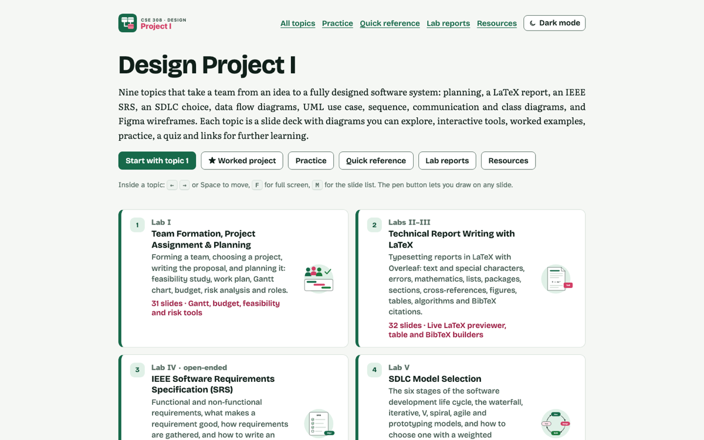
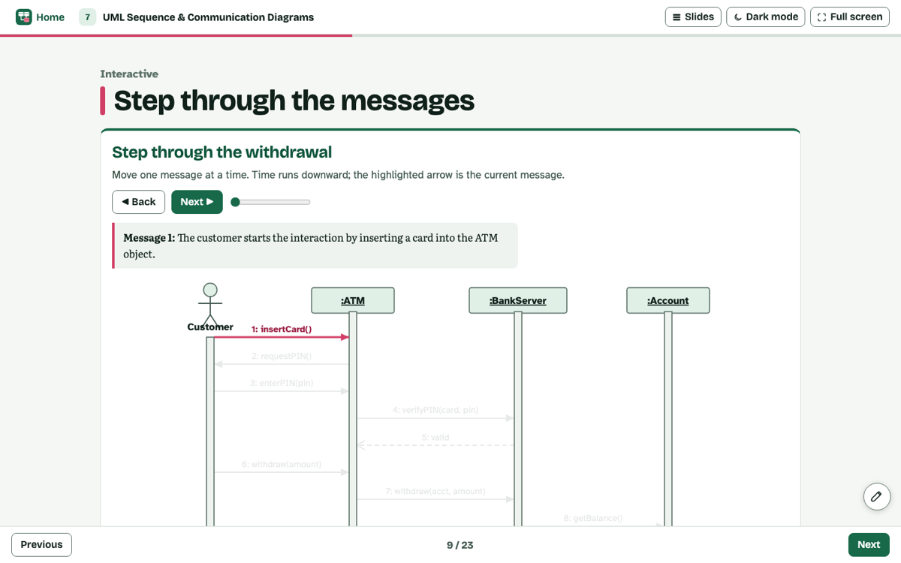

<div align="center">


# CSE 308 · Design Project I

**Interactive course notes for Design Project I: planning, LaTeX, IEEE SRS, SDLC, DFD, UML and Figma, with a worked project.**

<a href="https://ayan-1829.github.io/CSE-308-Design-Project-I/"></a>


### [🌐 Open the live site →](https://ayan-1829.github.io/CSE-308-Design-Project-I/)

</div>

<br>

<p align="center"> </p>

<p align="center"><a href="https://ayan-1829.github.io/CSE-308-Design-Project-I/practice.html">Practice problems</a> · <a href="https://ayan-1829.github.io/CSE-308-Design-Project-I/reference.html">Cheat sheet</a> · <a href="https://ayan-1829.github.io/CSE-308-Design-Project-I/projects.html">Lab reports</a> · <a href="https://ayan-1829.github.io/CSE-308-Design-Project-I/resources.html">Resources</a></p>

## ✨ Highlights

<table>
<tr><td width="50%" valign="top">🧭&nbsp; 9 lab decks plus a fully worked example project (CampusCare)</td><td width="50%" valign="top">🔍&nbsp; LaTeX playground with live preview, DFD and UML figures, and a sequence-diagram builder</td></tr>
<tr><td width="50%" valign="top">🧩&nbsp; Report templates, lab-report checklists saved in the browser and a quiz in every topic</td><td width="50%" valign="top">📝&nbsp; Practice problems, a searchable cheat sheet and curated resources per topic</td></tr>
</table>

## 📚 Topics

10 decks · 258 slides. Each title opens the live deck.

| # | Topic | Slides |
|:--:|---|:--:|
| **★** | [Worked Project: CampusCare Appointment System](https://ayan-1829.github.io/CSE-308-Design-Project-I/topics/00-worked-project-campuscare.html) | 22 |
| **1** | [Team Formation, Project Assignment & Planning](https://ayan-1829.github.io/CSE-308-Design-Project-I/topics/01-team-formation-and-project-planning.html) | 31 |
| **2** | [Technical Report Writing with LaTeX](https://ayan-1829.github.io/CSE-308-Design-Project-I/topics/02-technical-report-writing-with-latex.html) | 34 |
| **3** | [IEEE Software Requirements Specification (SRS)](https://ayan-1829.github.io/CSE-308-Design-Project-I/topics/03-ieee-software-requirements-specification.html) | 26 |
| **4** | [SDLC Model Selection](https://ayan-1829.github.io/CSE-308-Design-Project-I/topics/04-sdlc-model-selection.html) | 24 |
| **5** | [Data Flow Diagrams (DFD): Level 0 and Level 1](https://ayan-1829.github.io/CSE-308-Design-Project-I/topics/05-data-flow-diagrams-level-0-and-1.html) | 23 |
| **6** | [UML Use Case Diagrams](https://ayan-1829.github.io/CSE-308-Design-Project-I/topics/06-uml-use-case-diagrams.html) | 23 |
| **7** | [UML Sequence & Communication Diagrams](https://ayan-1829.github.io/CSE-308-Design-Project-I/topics/07-uml-sequence-and-communication-diagrams.html) | 23 |
| **8** | [UML Class Diagrams](https://ayan-1829.github.io/CSE-308-Design-Project-I/topics/08-uml-class-diagrams.html) | 26 |
| **9** | [UI/UX Foundations & Figma Wireframing](https://ayan-1829.github.io/CSE-308-Design-Project-I/topics/09-ui-ux-foundations-and-figma-wireframing.html) | 26 |

## ⌨️ Using the slides

| Key | Action |
|:--:|---|
| <kbd>←</kbd> <kbd>→</kbd> · <kbd>Space</kbd> | previous / next slide |
| <kbd>Home</kbd> · <kbd>End</kbd> | first / last slide |
| <kbd>F</kbd> | full screen for teaching |
| <kbd>M</kbd> | slide list |
| ✏️ | draw on any slide |

The address bar shows `#s=N`, so you can link straight to a slide. Light and dark themes follow your system, with a toggle in the header.

## 🚀 Run it locally

No build step, no server: clone the repository and open `index.html` in any modern browser.

```bash
git clone https://github.com/Ayan-1829/CSE-308-Design-Project-I.git
open CSE-308-Design-Project-I/index.html      # macOS · use start on Windows, xdg-open on Linux
```

<details>
<summary><b>🛠 Developer notes: folder layout and how the pages are built</b></summary>

```text
Folder layout
-------------
index.html            topic list
topics/*.html         nine slide decks (arrow keys, F full screen, M slide list, pen button to draw)
practice.html         every practice problem with answers
reference.html        searchable cheat sheet (UML, DFD, SRS, SDLC, LaTeX, UI/UX)
projects.html         lab-report checklists (saved in the browser) and a LaTeX report template
resources.html        curated links, tools and books per topic
404.html              "page not found" page for GitHub Pages
css/style.css         all styling (colour tokens at the top; light and dark themes)
js/core.js            helpers, theme toggle, storage
js/diagram.js         SVG kit for DFD / UML / process diagrams, and the sequence-diagram builder
js/figs.js            every figure (FIGS[id]) used by <figure class="fig" data-fig="id">
js/latex.js           LaTeX/BibTeX highlighter and the in-browser LaTeX previewer
js/demos.js           interactive tools (DEMOS[id]) used by <div data-demo="id">
js/quiz.js, js/page.js, js/slides.js, js/annotate.js   quiz, mounting, slide engine, drawing layer
js/analytics.js       shared cookieless analytics tracker (do not edit; same file in every project)
js/course-events.js   course events for the Course analytics Sheet: slide titles, quizzes, tools, answers
img/                  logo, favicons, social-share images (img/og/)
robots.txt, sitemap.xml, site.webmanifest   SEO files. The site address is https://ayan-1829.github.io/CSE-308-Design-Project-I/
                      (search-and-replace it everywhere if you publish somewhere else).

Editing a slide
---------------
Each slide is a <section class="slide" data-title="..."> inside a topic file; copy one, edit the
text and save. The slide counter and slide list update automatically.
```

</details>

## 🎓 All courses

| | Course | Live site | Repository |
|:--:|---|:--:|:--:|
|  | **CSE 201** · Object Oriented Programming | [Open](https://ayan-1829.github.io/CSE-201-Object-Oriented-Programming/) | [GitHub](https://github.com/Ayan-1829/CSE-201-Object-Oriented-Programming) |
|  | **CSE 202** · Object Oriented Programming Lab | [Open](https://ayan-1829.github.io/CSE-202-Object-Oriented-Programming-Lab/) | [GitHub](https://github.com/Ayan-1829/CSE-202-Object-Oriented-Programming-Lab) |
|  | **CSE 203** · Digital Logic Design | [Open](https://ayan-1829.github.io/CSE-203-Digital-Logic-Design/) | [GitHub](https://github.com/Ayan-1829/CSE-203-Digital-Logic-Design) |
|  | **CSE 308** · Design Project I **(this one)** | [Open](https://ayan-1829.github.io/CSE-308-Design-Project-I/) | [GitHub](https://github.com/Ayan-1829/CSE-308-Design-Project-I) |

---

<p align="center">Made by <b>Ayan Sarkar</b> · Green University of Bangladesh</p>
